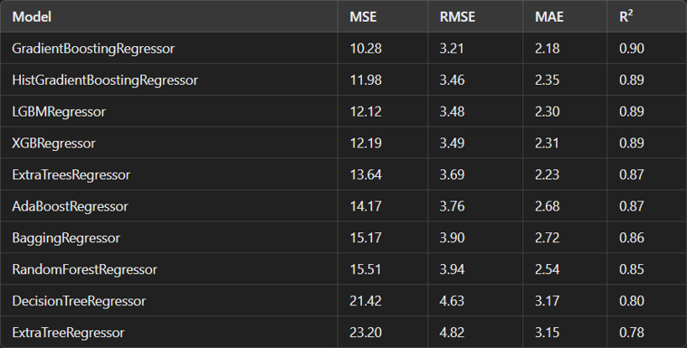

# Crash Course on TINTOlib: Tabular Data to Synthetic Images for Vision-Based Machine Learning

[](https://github.com/oeg-upm/TINTOlib-Documentation/blob/main/LICENSE)
[](https://github.com/oeg-upm/TINTOlib-Documentation/blob/main/LICENSE)
[](https://pypi.python.org/pypi/)
[](https://tintolib.readthedocs.io/en/latest/)
[](https://colab.research.google.com/github/DCY1117/ECAI2024-Material/blob/main/Notebooks/Challenge/Tensorflow_Regression_CNN.ipynb)
[](https://colab.research.google.com/github/DCY1117/ECAI2024-Material/blob/main/Notebooks/Challenge/Tensorflow_Regression_CNN%2BMLP.ipynb)
[](https://colab.research.google.com/github/DCY1117/ECAI2024-Material/blob/main/Notebooks/Challenge/Tensorflow_Regression_ViT.ipynb)
[](https://colab.research.google.com/github/DCY1117/ECAI2024-Material/blob/main/Notebooks/Challenge/Tensorflow_Regression_ViT%2BMLP.ipynb)

<div align="center">
  
</div>

## Description  
This repository provides a comprehensive crash course on using [TINTOlib](https://tintolib.readthedocs.io/en/latest/), a Python library designed to transform tabular data into synthetic images for machine learning tasks. It includes slides and Jupyter notebooks that demonstrate how to apply state-of-the-art vision models like Vision Transformers (ViTs) and Convolutional Neural Networks (CNNs) to problems such as regression and classification, using TINTOlib for data transformation.

The repository also features Hybrid Neural Networks (HyNNs), where one branch is an MLP designed to process tabular data, while another branch—either CNN or ViT—handles the synthetic images. This architecture leverages the strengths of both data formats for enhanced performance on complex machine learning tasks. Ideal for those looking to integrate image-based deep learning techniques into tabular data problems.

## Features
- Input data formats (2 options):
    - **Pandas Dataframe** 
    - **Files with the following format** 
        - **Tabular files**: The input data must be in **[CSV](https://en.wikipedia.org/wiki/Comma-separated_values)**, taking into account the **[Tidy Data](https://www.jstatsoft.org/article/view/v059i10)** format.
        - **Tidy Data**: The **target** (variable to be predicted) should be set as the last column of the dataset. Therefore, the first columns will be the features.
        - All data must be in numerical form.
        
- Runs on **Linux**, **Windows** and **macOS** systems.
- Compatible with **[Python](https://www.python.org/)** 3.7 or higher.

## Materials


## Practical Session

Work in groups to try and  surpass the baseline set by classical models on the Boston housing dataset.

Lazypredict - refer to this notebook: `Notebooks/Lazypredict/LazyPredict_Regression.ipynb`



Using synthetic images, experiment with either vision models like CNNs or ViTs, and explore hybrid models. Below are the architectures that will be presented, and the ones you will modify and use during the session:

- **Synthetic images using CNN**  
  

- **Synthetic images using Hybrid Neural Network with ViT (HyNNViT)**  
  

## Notebooks - Open in Colab

Here are the notebooks you can directly open and run in Google Colab:

**Note**: Before running the notebooks, you will need to download the required dataset. For the practical session, we will use a small dataset, specifically the **Boston housing dataset**, which is located in `Data/Regression/boston.csv`.

The notebooks listed below are designed for regression tasks:

- **TensorFlow - CNN**:  
  [](https://colab.research.google.com/github/DCY1117/ECAI2024-Material/blob/main/Notebooks/Challenge/Tensorflow_Regression_CNN.ipynb)

- **TensorFlow - CNN + MLP Hybrid**:  
  [](https://colab.research.google.com/github/DCY1117/ECAI2024-Material/blob/main/Notebooks/Challenge/Tensorflow_Regression_CNN%2BMLP.ipynb)

- **TensorFlow - Vision Transformer (ViT)**:  
  [](https://colab.research.google.com/github/DCY1117/ECAI2024-Material/blob/main/Notebooks/Challenge/Tensorflow_Regression_ViT.ipynb)

- **TensorFlow - ViT + MLP Hybrid**:  
  [](https://colab.research.google.com/github/DCY1117/ECAI2024-Material/blob/main/Notebooks/Challenge/Tensorflow_Regression_ViT%2BMLP.ipynb)

## Methods for Tabular-to-Image Transformation

In this tutorial, we will explore various methods to transform tabular data into images to take advantage of deep learning models such as Convolutional Neural Networks (CNNs) and Vision Transformers (ViTs).

**TINTOlib** is a state-of-the-art library that wraps the most important techniques for the construction of **Synthetic Images** from [Sorted Data](https://www.jstatsoft.org/article/view/v059i10) (also known as **Tabular Data**). 

**Citing TINTO**: If you used TINTO in your work, please cite the **[SoftwareX](https://doi.org/10.1016/j.softx.2023.101391)**:

```bib
@article{softwarex_TINTO,
    title = {TINTO: Converting Tidy Data into Image for Classification with 2-Dimensional Convolutional Neural Networks},
    journal = {SoftwareX},
    author = {Manuel Castillo-Cara and Reewos Talla-Chumpitaz and Raúl García-Castro and Luis Orozco-Barbosa},
    volume={22},
    pages={101391},
    year = {2023},
    issn = {2352-7110},
    doi = {https://doi.org/10.1016/j.softx.2023.101391}
}
```

And use-case developed in **[INFFUS Paper](https://doi.org/10.1016/j.inffus.2022.10.011)** 

```bib
@article{inffus_TINTO,
    title = {A novel deep learning approach using blurring image techniques for Bluetooth-based indoor localisation},
    journal = {Information Fusion},
    author = {Reewos Talla-Chumpitaz and Manuel Castillo-Cara and Luis Orozco-Barbosa and Raúl García-Castro},
    volume = {91},
    pages = {173-186},
    year = {2023},
    issn = {1566-2535},
    doi = {https://doi.org/10.1016/j.inffus.2022.10.011}
}
```

All the methods presented can be called using the TINTOlib library. The methods presented include:

|                              Model                               |    Class     | Features |                                                                Hyperparameters                                                                 |
|:----------------------------------------------------------------:|:------------:|:--------:|:----------------------------------------------------------------------------------------------------------------------------------------------:|
|            [TINTO](https://github.com/oeg-upm/TINTO)             |  `TINTO()`   |  `blur`  |                   `problem` `algorithm` `pixels` `submatrix` `blur` `amplification` `distance` `steps` `option` `random_seed` `times` `verbose`                   |
|             [IGTD](https://github.com/zhuyitan/igtd)             |   `IGTD()`   |          | `problem` `scale` `fea_dist_method` `image_dist_method` `max_step` `val_step` `error` `switch_t` `min_gain` `zoom` `random_seed` `verbose` |
|       [REFINED](https://github.com/omidbazgirTTU/REFINED)        | `REFINED()`  |          |                                                      `problem` `n_processors` `hcIterations` `zoom` `random_seed` `verbose`      |
|                           [BarGraph]()                           | `BarGraph()`  |          |                                                    `problem` `pixel_width` `gap`  `zoom` `verbose`                                                    |
|                        [DistanceMatrix]()                        | `DistanceMatrix()`  |          |                                                          `problem` `zoom`  `verbose`                                                          |
|                         [Combination]()                          | `Combination()`  |          |                                                             `problem` `zoom`  `verbose`                                                              |
| [SuperTML](https://github.com/GilesStrong/SuperTML_HiggsML_Test) | `SuperTML()` |          |                                             `problem` `columns` `font_size` `image_size` `verbose`                                             |
|                         [FeatureWrap]()                          | `FeatureWrap()`  |          |                                                             `problem` `size` `bins` `zoom` `verbose`                                                              |
|                         [BIE]()                          | `BIE()`  |          |                                                             `problem` `precision` `zoom` `verbose`                                                              |

### Documentation

- For more detailed information, refer to the **[TINTOlib ReadTheDocs](https://tintolib.readthedocs.io/en/latest/)**.  
- GitHub repository: **[TINTOlib Documentation](https://github.com/oeg-upm/TINTOlib-Documentation)**.
- PyPI: **[PyPI](https://pypi.org/project/TINTOlib/)**.


## Authors
- **[Manuel Castillo-Cara](https://github.com/manwestc) - [manuelcastillo@dia.uned.es](manuelcastillo@dia.uned.es)**
- **[Raúl García-Castro](https://github.com/rgcmme) - [r.garcia@upm.es](r.garcia@upm.es)**
- **[Jiayun Liu](https://github.com/DCY1117) - [jiayun.liu@upm.es](jiayun.liu@upm.es)**

## Contributors

<div>
<p align = "center">
<kbd></kbd> <kbd></kbd> <kbd></kbd> <kbd></kbd> 
</p>
</div>


