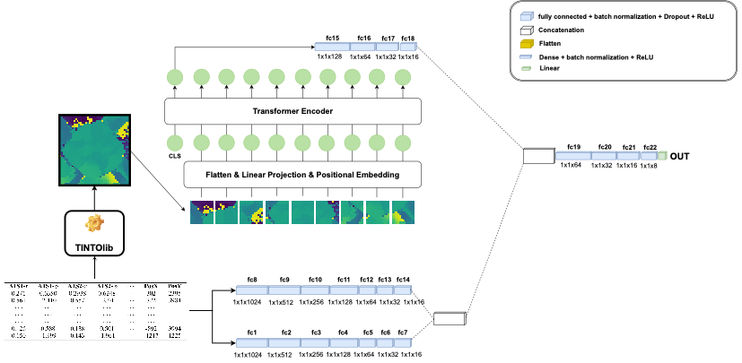

# Crash Course on [TINTOlib](https://tintolib.readthedocs.io/en/latest/): Convert Tabular Data into Synthetic Images for Vision-Based Deep Neural Networks

[](https://github.com/oeg-upm/TINTOlib-Documentation/blob/main/LICENSE)
[](https://pypi.python.org/pypi/)
[](https://tintolib.readthedocs.io/en/latest/)
[](https://colab.research.google.com/github/DCY1117/ECAI2024-Material/blob/main/Notebooks/Challenge/Tensorflow_Regression_CNN.ipynb)
[](https://colab.research.google.com/github/DCY1117/ECAI2024-Material/blob/main/Notebooks/Challenge/Tensorflow_Regression_CNN%2BMLP.ipynb)
[](https://colab.research.google.com/github/DCY1117/ECAI2024-Material/blob/main/Notebooks/Challenge/Tensorflow_Regression_ViT.ipynb)
[](https://colab.research.google.com/github/DCY1117/ECAI2024-Material/blob/main/Notebooks/Challenge/Tensorflow_Regression_ViT%2BMLP.ipynb)

<div align="center">
  
</div>


## 🎉 New Free Course on Udemy! (Espanish) 🎉

**We’ve just launched a 100% free course on Udemy** about **using TINTOlib** and developing **Hybrid Neural Networks**.

Learn how to turn tabular data into synthetic images and apply CNNs, ViTs, and hybrid architectures like a pro.

<p align="center">
  <a href="https://www.udemy.com/course/tintolib-deep-learning-tabutar-data-con-imagenes-sinteticas/?referralCode=16B7C59C2E3B0BD249D0" target="_blank">
    
  </a>
</p>

---

### 📺 VideoTutorial Course (English/Spanish)

🎥 Prefer not to register on Udemy or looking for the English version of the course? No worries — you can follow the full course directly on GitHub!

This hands-on tutorial includes **bilingual videos (English/Spanish)** and **practical notebooks** to help you learn how to use **TINTOlib** with deep learning models like CNNs, ViTs, and hybrid architectures.

<p align="center">
  <a href="./5_TINTOlib%20Videotutorial%20course/README.md" target="_blank">
    
  </a>
</p>

---

## 🧠 Description  
This repository provides a comprehensive crash course on using [TINTOlib](https://tintolib.readthedocs.io/en/latest/), a Python library designed to transform tabular data into synthetic images for machine learning tasks. It includes videotutorials, slides and Jupyter notebooks that demonstrate how to apply state-of-the-art vision models like Vision Transformers (ViTs) and Convolutional Neural Networks (CNNs) to problems such as regression and classification, using [TINTOlib](https://tintolib.readthedocs.io/en/latest/) for data transformation.

The repository also features Hybrid Neural Networks (HyNNs), where one branch is an MLP designed to process tabular data, while another branch—either CNN or ViT—handles the synthetic images. This architecture leverages the strengths of both data formats for enhanced performance on complex machine learning tasks. Ideal for those looking to integrate image-based deep learning techniques into tabular data problems.

---

## 📚 Materials

This [TINTOlib](https://tintolib.readthedocs.io/en/latest/) crash course is organized into the following main folders:

- **0_Complete course**: Contains full course materials, including PDF presentations on ML, deep learning, CNNs, Transformers, and synthetic images. Inside, the `Jupyters Notebooks` folder provides step-by-step tutorials and practical exercises.
- **1_Notebooks**: Practical notebooks for various tasks and frameworks.
  - **Challenge**: Contains notebooks and data for the practical session, check the "Practical Session" section below.
  - **Lazypredict**: Quick baseline models for classification and regression.
  - **Pytorch**: Example notebooks showcasing PyTorch implementations (e.g., ViT, hybrid models).
  - **Tensorflow**: Example notebooks showcasing TensorFlow/Keras implementations (e.g., CNNs, ViTs, hybrid models).
- **2_Data**: Datasets for binary/multiclass classification or regression tasks.
- **3_Images**: Images and diagrams used throughout the documentation and notebooks.
- **4_ECAI2024_Slide**: Slides for the ECAI 2024 tutorial session.
- **5_TINTOlib Videotutorial course**: English/Spanish video course with theory and practice.

---

## 🔧 Features
- Input formats: **CSV** or Pandas DataFrame
- Designed for tidy data (**target column last**)
- Output: grayscale images from reduction and transformation methods
- Compatible with **Linux, Windows, macOS**
- Requires **Python 3.7+**

---

## 🚀 Vision-based Neural Network Architectures

Using synthetic images, experiment with either vision models like CNNs or ViTs, and explore hybrid models. Below are the architectures that will be presented, and the ones you will modify and use during the session:

- **Synthetic images using CNN**  
  

- **Synthetic images using Hybrid Neural Network with ViT (HyViT)**  
  

---
<!--
## 🧩 Notebooks - Open in Colab

Here are the notebooks you can directly open and run in Google Colab:

**Note**: Before running the notebooks, you will need to download the required dataset. For the practical session, we will use a small dataset, specifically the **Boston housing dataset**, which is located in `Data/Regression/boston.csv`.

The notebooks listed below are designed for regression tasks:

- **TensorFlow - CNN**:  
  [](https://colab.research.google.com/github/DCY1117/ECAI2024-Material/blob/main/Notebooks/Challenge/Tensorflow_Regression_CNN.ipynb)

- **TensorFlow - CNN + MLP Hybrid**:  
  [](https://colab.research.google.com/github/DCY1117/ECAI2024-Material/blob/main/Notebooks/Challenge/Tensorflow_Regression_CNN%2BMLP.ipynb)

- **TensorFlow - Vision Transformer (ViT)**:  
  [](https://colab.research.google.com/github/DCY1117/ECAI2024-Material/blob/main/Notebooks/Challenge/Tensorflow_Regression_ViT.ipynb)

- **TensorFlow - ViT + MLP Hybrid**:  
  [](https://colab.research.google.com/github/DCY1117/ECAI2024-Material/blob/main/Notebooks/Challenge/Tensorflow_Regression_ViT%2BMLP.ipynb)

---
-->

## 🧪 Methods for Tabular-to-Image Transformation

All the methods presented can be called using the [TINTOlib](https://tintolib.readthedocs.io/en/latest/) library. The methods presented include:

| Models | Class | Hyperparameters |
|:----------------------------------------------------------------:|:------------:|:-------------------------------------------------------------------------------------------------------------------------------------------------------------------------------:|
| [TINTO](https://github.com/oeg-upm/TINTO) | `TINTO()` | `problem` `normalize` `verbose` `pixels` `algorithm` `blur` `submatrix` `amplification` `distance` `steps` `option` `times` `train_m` `zoom` `random_seed` |
| [IGTD](https://github.com/zhuyitan/igtd) | `IGTD()` | `problem` `normalize` `verbose` `scale` `fea_dist_method` `image_dist_method` `error` `max_step` `val_step` `switch_t` `min_gain` `zoom` `random_seed` |
| [REFINED](https://github.com/omidbazgirTTU/REFINED) | `REFINED()` | `problem` `normalize` `verbose` `hcIterations` `n_processors` `zoom` `random_seed` |
| [BarGraph](https://github.com/anuraganands/Non-image-data-classification-with-CNN/) | `BarGraph()` | `problem` `normalize` `verbose` `pixel_width` `gap` `zoom` |
| [DistanceMatrix](https://github.com/anuraganands/Non-image-data-classification-with-CNN/) | `DistanceMatrix()` | `problem` `normalize` `verbose` `zoom` |
| [Combination](https://github.com/anuraganands/Non-image-data-classification-with-CNN/) | `Combination()` | `problem` `normalize` `verbose` `zoom` |
| [SuperTML](https://github.com/GilesStrong/SuperTML_HiggsML_Test) | `SuperTML()` | `problem` `normalize` `verbose` `pixels` `feature_importance` `font_size` `random_seed` |
| [FeatureWrap](https://link.springer.com/chapter/10.1007/978-3-319-70139-4_87) | `FeatureWrap()` | `problem` `normalize` `verbose` `size` `bins` `zoom` |
| [BIE](https://ieeexplore.ieee.org/document/10278393) | `BIE()` | `problem` `normalize` `verbose` `precision` `zoom` |

---

## 💬 More information

- For more detailed information, refer to the **[TINTOlib ReadTheDocs](https://tintolib.readthedocs.io/en/latest/)**.  
- GitHub repository: **[TINTOlib Documentation](https://github.com/oeg-upm/TINTOlib-Documentation)**.
- PyPI: **[PyPI](https://pypi.org/project/TINTOlib/)**.

---

## 🧪 Citing TINTO: 

If you used TINTO in your work, please cite the **[SoftwareX](https://doi.org/10.1016/j.softx.2023.101391)**:

```bib
@article{softwarex_TINTO,
    title = {TINTO: Converting Tidy Data into Image for Classification with 2-Dimensional Convolutional Neural Networks},
    journal = {SoftwareX},
    author = {Manuel Castillo-Cara and Reewos Talla-Chumpitaz and Raúl García-Castro and Luis Orozco-Barbosa},
    volume={22},
    pages={101391},
    year = {2023},
    issn = {2352-7110},
    doi = {https://doi.org/10.1016/j.softx.2023.101391}
}
```

And use-case developed in **[INFFUS Paper](https://doi.org/10.1016/j.inffus.2022.10.011)** 

```bib
@article{inffus_TINTO,
    title = {A novel deep learning approach using blurring image techniques for Bluetooth-based indoor localisation},
    journal = {Information Fusion},
    author = {Reewos Talla-Chumpitaz and Manuel Castillo-Cara and Luis Orozco-Barbosa and Raúl García-Castro},
    volume = {91},
    pages = {173-186},
    year = {2023},
    issn = {1566-2535},
    doi = {https://doi.org/10.1016/j.inffus.2022.10.011}
}
```


---

## 👥 Authors
- **[Manuel Castillo-Cara](https://github.com/manwestc) - [manuelcastillo@dia.uned.es](manuelcastillo@dia.uned.es)**
- **[Raúl García-Castro](https://github.com/rgcmme) - [r.garcia@upm.es](r.garcia@upm.es)**
- **[Jiayun Liu](https://github.com/DCY1117) - [jiayun.liu@upm.es](jiayun.liu@upm.es)**

---

## 🏛️ Institutions

<div>
<p align = "center">
<kbd></kbd> <kbd></kbd> <kbd></kbd> <kbd></kbd> 
</p>
</div>


